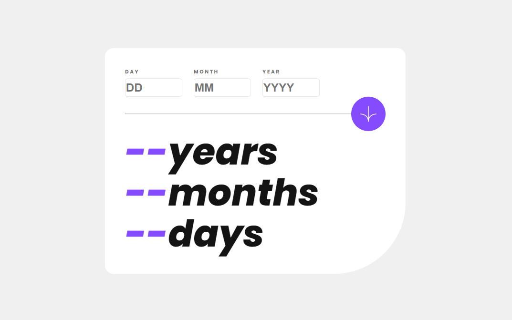

# Frontend Mentor - Age calculator app solution

This is a solution to the [Age calculator app challenge on Frontend Mentor](https://www.frontendmentor.io/challenges/age-calculator-app-dF9DFFpj-Q). Frontend Mentor challenges help you improve your coding skills by building realistic projects. 

## Table of contents

- [Overview](#overview)
  - [The challenge](#the-challenge)
  - [Screenshot](#screenshot)
  - [Links](#links)
- [My process](#my-process)
  - [Built with](#built-with)
  - [What I learned](#what-i-learned)
  - [Continued development](#continued-development)
  - [Useful resources](#useful-resources)
- [Author](#author)
- [Acknowledgments](#acknowledgments)

## Overview

### The challenge

Users should be able to:

- View an age in years, months, and days after submitting a valid date through the form
- Receive validation errors if:
  - Any field is empty when the form is submitted
  - The day number is not between 1-31
  - The month number is not between 1-12
  - The year is in the future
  - The date is invalid e.g. 31/04/1991 (there are 30 days in April)
- View the optimal layout for the interface depending on their device's screen size
- See hover and focus states for all interactive elements on the page

### Screenshot



### Links

- Solution URL: [https://github.com/Leandr0SmS/Frontend-Mentor-Projects/tree/main/age-calculator-app](https://github.com/Leandr0SmS/Frontend-Mentor-Projects/tree/main/age-calculator-app)
- Live Site URL: [https://leandr0sms.github.io/Frontend-Mentor-Projects/age-calculator-app/index.html](https://leandr0sms.github.io/Frontend-Mentor-Projects/age-calculator-app/index.html)

## My process

### Built with

- Semantic HTML5 markup
- CSS custom properties
- Flexbox
- CSS Grid
- Mobile-first workflow
- [React](https://reactjs.org/) - JS library
- [Next.js](https://nextjs.org/) - React framework

### What I learned

The use of new Date(), .getFullYear()

```
```js
  let currentDate = new Date();
  let currentYear = currentDate.getFullYear();
  let currentMonth = currentDate.getMonth() + 1; // Month is zero-based, so add 1
  let currentDay = currentDate.getDate();
```

### Continued development

I need to improve and pratice React.

## Author

- Frontend Mentor - [@Leandr0SmS](https://www.frontendmentor.io/profile/Leandr0SmS)

## Acknowledgments

- (MDN)[https://developer.mozilla.org/]
- (W3School)[https://www.w3schools.com/]
- (FreeCodeCamp)[https://www.freecodecamp.org/]
- (CodeCademy) [https://www.codecademy.com/]
- (Scrimba) [https://scrimba.com/learn/learnreact]
- (Chat-GPT) [https://chat.openai.com]
