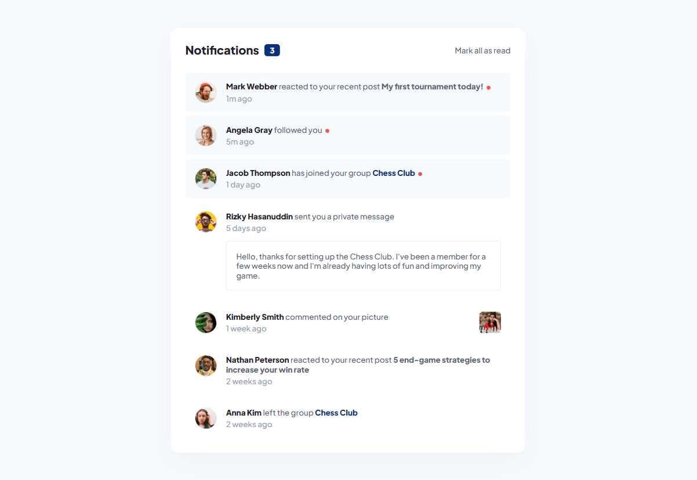

# Frontend Mentor - Notifications page solution

This is a solution to the [Notifications page challenge on Frontend Mentor](https://www.frontendmentor.io/challenges/notifications-page-DqK5QAmKbC). Frontend Mentor challenges help you improve your coding skills by building realistic projects. 

## Table of contents

- [Overview](#overview)
  - [The challenge](#the-challenge)
  - [Screenshot](#screenshot)
  - [Links](#links)
- [My process](#my-process)
  - [Built with](#built-with)
  - [What I learned](#what-i-learned)
  - [Continued development](#continued-development)
- [Author](#author)
- [Acknowledgments](#acknowledgments)

## Overview

### The challenge

Users should be able to:

- Distinguish between "unread" and "read" notifications
- Select "Mark all as read" to toggle the visual state of the unread notifications and set the number of unread messages to zero
- View the optimal layout for the interface depending on their device's screen size
- See hover and focus states for all interactive elements on the page

### Screenshot

### Links

- Solution URL: [https://github.com/Leandr0SmS/Frontend-Mentor-Projects/tree/main/notifications-page-main](https://github.com/Leandr0SmS/Frontend-Mentor-Projects/tree/main/notifications-page-main)
- Live Site URL: [https://leandr0sms.github.io/Frontend-Mentor-Projects/notifications-page-main/index.html](https://leandr0sms.github.io/Frontend-Mentor-Projects/notifications-page-main/index.html)

## My process

### Built with

- Semantic HTML5 markup
- CSS custom properties
- Flexbox
- CSS Grid
- Mobile-first workflow
- [React](https://reactjs.org/) - JS library

### Continued development

I need to improve and pratice React.

## Author

- Frontend Mentor - [@Leandr0SmS](https://www.frontendmentor.io/profile/Leandr0SmS)

## Acknowledgments

- (MDN)[https://developer.mozilla.org/]
- (W3School)[https://www.w3schools.com/]
- (FreeCodeCamp)[https://www.freecodecamp.org/]
- (CodeCademy) [https://www.codecademy.com/]
- (Scrimba) [https://scrimba.com/learn/learnreact]
- (Chat-GPT) [https://chat.openai.com]
